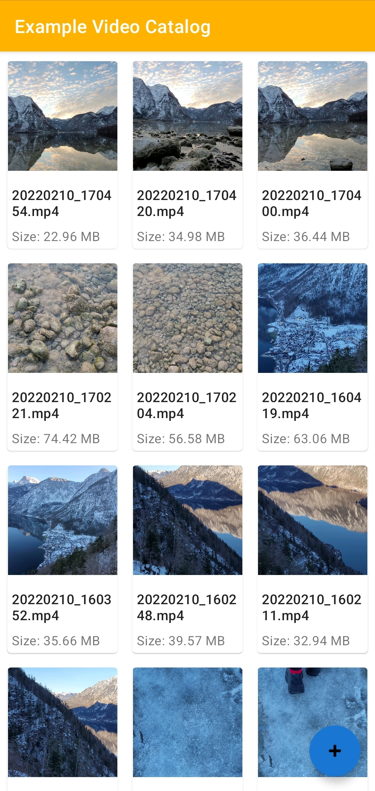
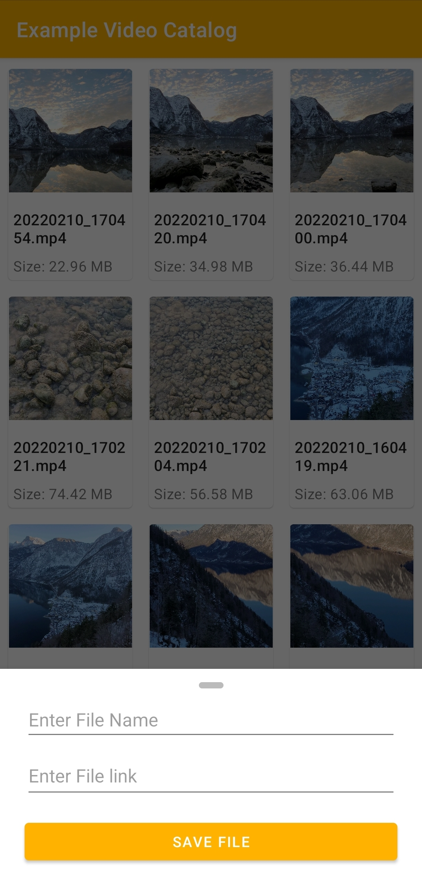

# Simple Video File Manager

This application allows to view and manage video clips on the device using a <a href="https://developer.android.com/reference/android/content/ContentResolver" target="_blank"><i>ContentResolver</i></a> and a <a href="https://developer.android.com/reference/android/database/Cursor" target="_blank"><i>Cursor</i></a> to move through the <a https://developer.android.com/reference/android/provider/MediaStore" target="_blank"><i>MediaStore</i></a>.

## About

### Functionality
- View Video clips on the device
- Link download Video clips to the device
- Saving the file to a folder of user's choice
- Check download progress in Notifications
- Adding and Removing from Favorites (API>30)
- Moving to the trash (API>30) or deleting (other) files

### UI
- [Material 2](https://material.io/develop/android)
- [Navigation component](https://developer.android.com/jetpack/androidx/releases/navigation)
- [Glide](https://github.com/bumptech/glide)

### Features

- [Kotlin Flow](https://developer.android.com/kotlin/flow)
- [Coroutines](https://developer.android.com/kotlin/coroutines)
- [MVVM architecture](https://developer.android.com/topic/architecture)
- [View binding Extensions](https://developer.android.com/topic/libraries/view-bindinge)

### Networking
- [Retrofit 2](https://square.github.io/retrofit/)
- [Okhttp3](https://square.github.io/okhttp/)

### Permissions
- [Permissions Dispatcher](https://github.com/permissions-dispatcher/PermissionsDispatcher)
